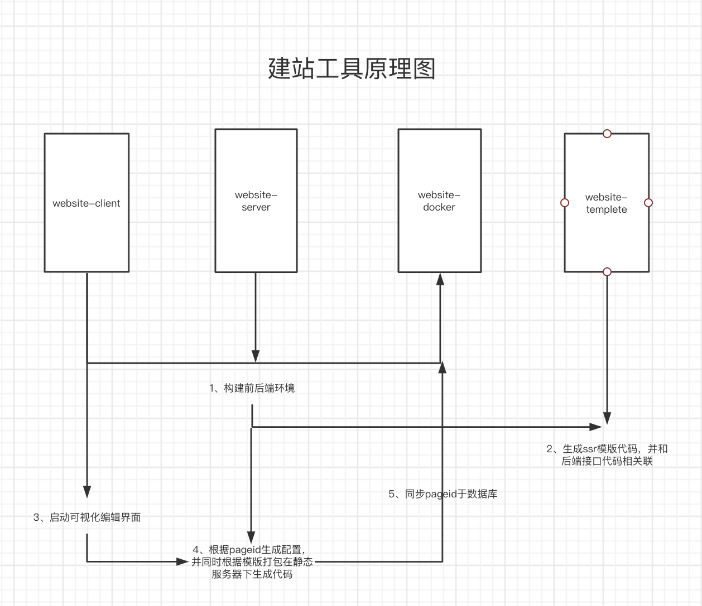

# 建站工具
+ 功能描述
  + 一套服务于运营的建站工具，主要功能包括，页面模板crud、运营h5页面的增删改查、在线预览功能
+ 主要技术栈
  + egg生态、vue全家桶、 docker部署
  + [egg文档](https://eggjs.github.io/)
+ 原理图
  
+ 项目目的
  + 主要是用于建站工具思想上的学习和技术提升，如果后续公司有需求，可以能入手搭建
  + 帮助一些做资质的朋友实现免费网站编辑
+ 项目参考
  + [项目参考](https://github.com/page-pipepline/pipeline-editor)